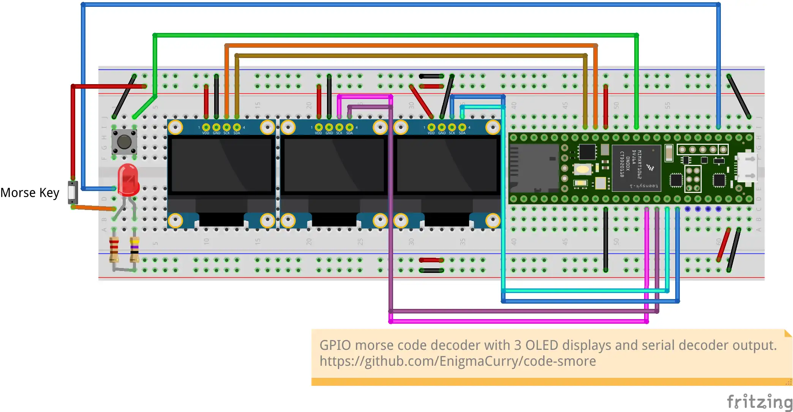

# Teensy GPIO morse decoder

This is an embedded morse code decoder running on the Teensy 4.1. It
has 3 OLED dispalys to display the decoded message in realtime. 




# Setup Arduino IDE for Teensy boards

## Install Arduino IDE v2

```
flatpak install flathub cc.arduino.IDE2
```

Run `Arduino IDE v2` via your app launcher, or do so in the terminal:

```
flatpak run cc.arduino.IDE2
```

### Setup Arduino IDE for Teensy 4.1

 * upstream docs: https://www.pjrc.com/teensy/td_download.html
 * Go to `File` -> `Preferences`
 * Scroll to the bottom to find `Additional boards manager URLS`.
 * Enter the Teensyduino repository URL: `https://www.pjrc.com/teensy/package_teensy_index.json`
 * While you're here, you can choose a nicer (darker) theme.
 * Click `OK`.
 * Go to `Tools` -> `Board` -> `Boards Manager`.
 * Search for  "teensy"" and install `Teensy (for Arduino IDE ...)` (latest version)

